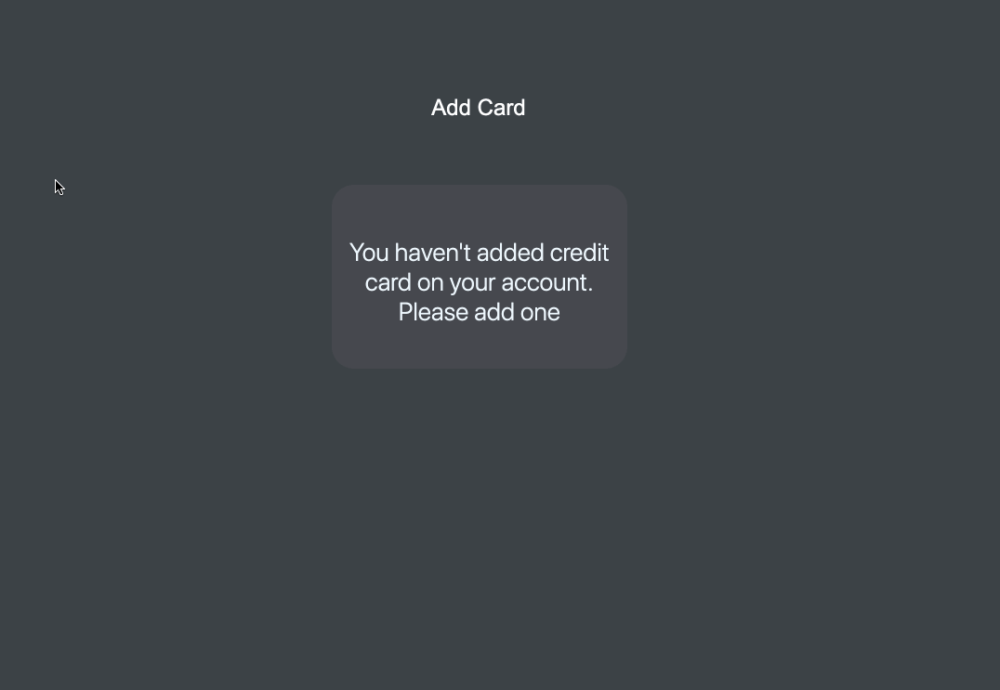

# DTO for modeling Credit Card Payment Project
 
 This DTO for modeling Credit Card Payment project , We can add credit card and get the payment details though the NgRx state management.

## Development notes
Following are the some developer setup need for running this project.

# Prerequisite Version 
1. Angular CLI: 11.0.3
2. Node: 12.0.0
3. Angular: 11.0.3

## Steps to run the local Repository.

1. `clone https://github.com/Mangesh55/dto-credit-card-payments.git`
2. `npm install`
3. `ng serve`

## Following are the coding styles is used to build website:
1. Used `typescript interfaces` for strong types for `variables and parameters`.
2. Used `RxJS` for store the data(Success/Failure).
3. Used `Reactive Forms` to get data in form.
4. Used `access modifiers`, `return types` for variables and functions.

## Gif for refernce 

